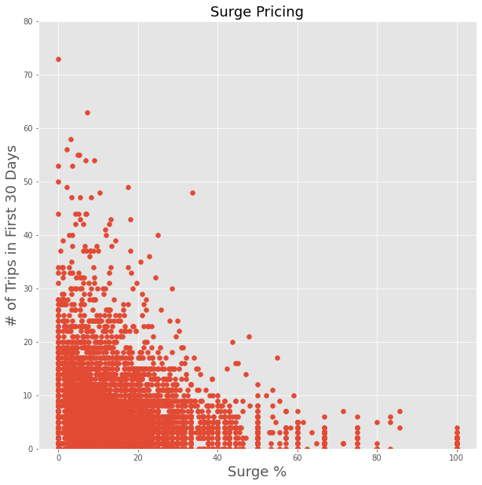
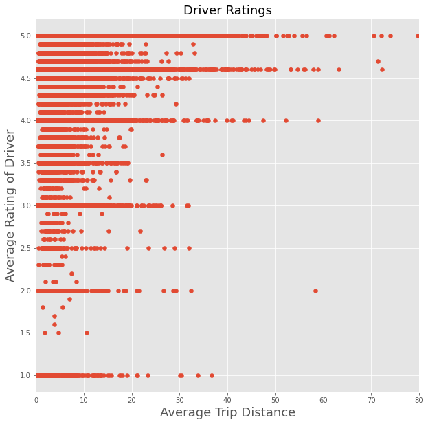
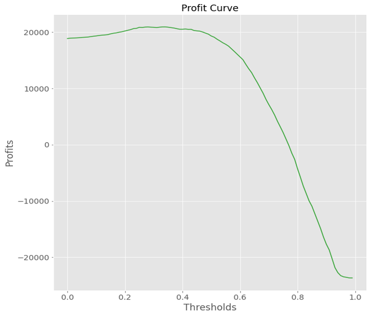
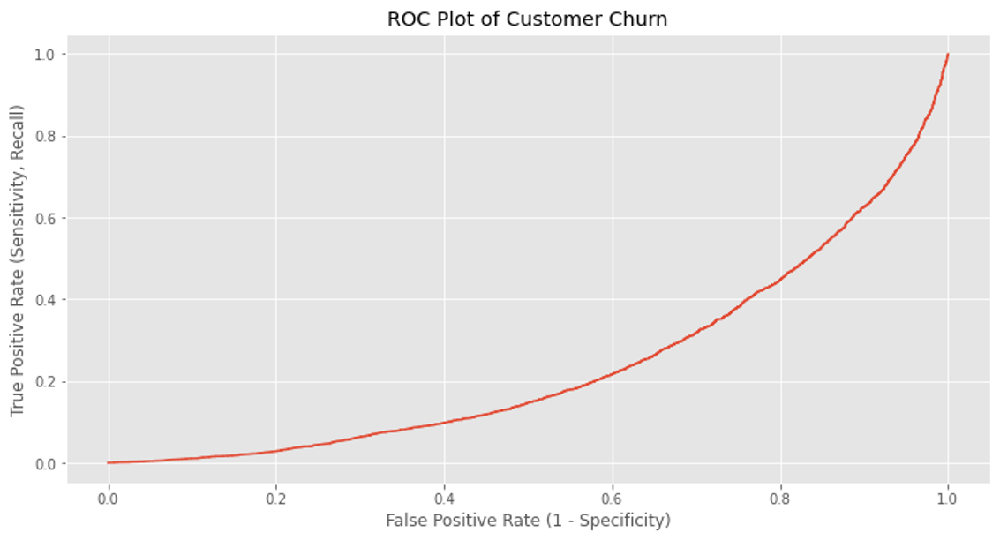
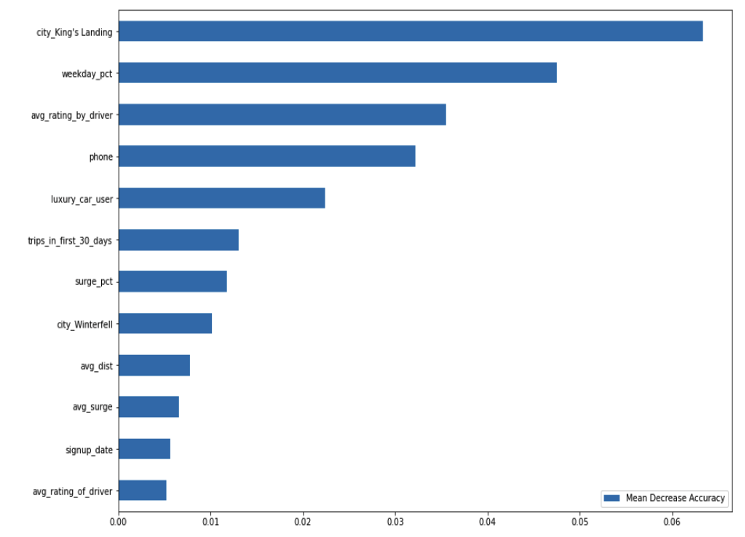
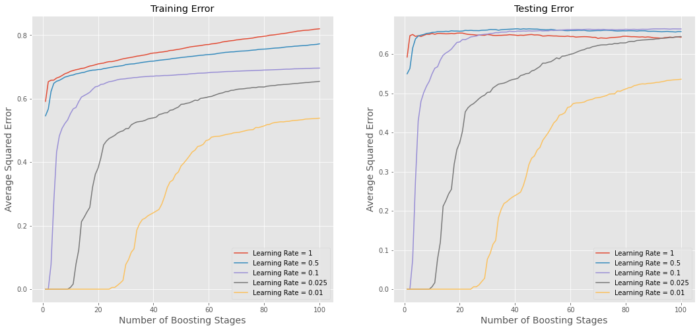
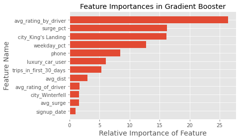

# Rideshare-Prediction Using Supervised Learning

We are interested in predicting rider retention for a ride-sharing company (Company X, data is not public). We utilize a dataset collected in 2014 to train and test supervised learning classification models to determine whether a rider is active or inactive. A rating of 'inactive' could be used to target additional promotional materials at inactive riders, to help increase retention rates for the company. The full dataset contains data for 50,000 riders, with features including:

* Average trip distance
* Average rating of rider
* Average rating of driver
* Average surge
* City
* Last trip date
* Phone type
* Signup date
* Surge percentage
* number of trips in first month
* Luxury car use
* Weekday ridership percentage

To create our target variable, we classify riders whose last trip date was in the past month as 'active', and riders who have not taken a trip in the past month as 'inactive'. We then remove the 'Last Trip Date' column from the main dataset to avoid data leakage. 

### Data Cleaning

To clean and prepare the data for modeling, we first divided the full dataset into a master train and test set. The test set will not be used until the best model has been chosen by training and testing on the test dataset, and then the test set will be used to test the results of the best supervised learning model.

To clean the dataset, we:

* converted dates to datetime using Pandas
* removed rows with null values (less than 1% of data)
* assigned 0 or 1 values for phone type column and true/false luxury car use column
* created dummy variables for cities
* removed special characters from feature names

### Exploratory Data Analysis

We conducted preliminary exploratory data analysis on the dataset by creating scatter matrix visualizations and histograms to visualize correlations between features. 

We found that weekday ridership tended to result in more rides, possibly because weekday riders used the rideshare service to get to work rather than just taking occasional weekend trips:

We also found that surge pricing tended to result in less trips in the first 30 days, perhaps reducing rider retention: 

Interestingly, higher driver ratings were correlated with higher trip distance:

## Supervised Learning Models

We trained and tested three different supervised learning classification models: 
* Logistic Regression
* Random Forest Classifier
* Gradient Boosting Classifier

### Logistic Regression

We trained a logistic regression model on a train/test split using K-fold validation, and tested the model to get an accuracy of 0.7185, a precision of 0.6752, and a recall of 0.5025. We focus on recall as being the best indicator of model predition success, as recall shows us the number of false negatives the model produces. We want to minimize the number of false negatives to prevent rider churn. 

Here is an example cost matrix created with estimated values for the results of customers staying with the service or churning. It is used to produce the profit curve below:

|        | Predicted  | Churn | Stay |
| Actual | ---------- | ----  | ---- |
| Churn  |            |$0     | -$10 |
| Stay   |            | $5    | $10  |

### Random Forest Classifier

We trained a random forest classifier model using a train/test split and optimized the model by trying suites of different values for number of estimators, max depth, minimum samples per split, minimum samples per leaf, and max features. Our optimized model had an accuracy of 0.7726, a precision of 0.7192, and a recall of 0.6494 when tested on the test set.

We calculated feature importances for our random forest classifier model using the Mean Decrease Accuracy:

### Gradient Boosting Classifier

We trained a gradient boosting classifier model using a train/test split and optimized the model by conducting a grid search over several chosen values for each hyperparameters, including loss type, learning rate, number of estimators, min samples per leaf, and max depth to find the best model. Our grid-search optimized model had an accuracy of 0.7880, a precision of 0.7485, and a recall of 0.6612.

To demonstrate the effect of different learning rates on this type of mdoel, we plotted the training error vs testing error for different learning rates. Since we only used 100 trees, this does not give the model time to access the benefits of the slower learning rates.

## Best Model: Gradient Boosting Classifier

The best model in terms of recall score was the gradient boosting classifier. 

We calculated relative feature importances for our random forest classifier model using the Mean Decrease Impurity, which must be analyzed cautiously as this method is likely to assign numerical values higher importance than categorical variables, since numerical variables have more frequent opportunities for use in the model but do not necessarily have higher importance overall:

To improve this model, we would conduct more feature engineering and hyperparameter tuning to improve the recall score to the point where it would be useful in a production setting.

This case study was conducted by Chun Liu, Alek Sanchez, and Kaelynn Rose.
