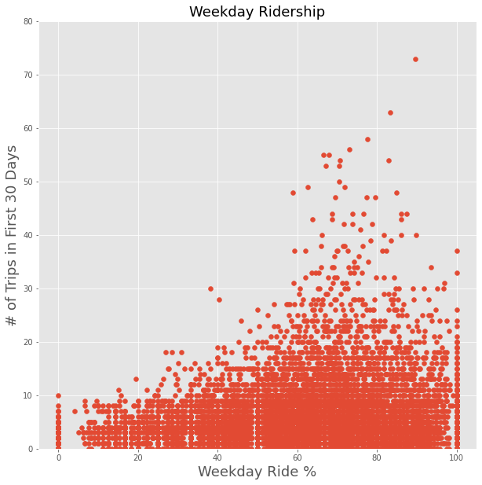

# Rideshare-Prediction Using Supervised Learning

We are interested in predicting rider retention for a ride-sharing company (Company X, data is not public). We utilize a dataset collected in 2014 to train and test supervised learning classification models to determine whether a rider is active or inactive. A rating of 'inactive' could be used to target additional promotional materials at inactive riders, to help increase retention rates for the company. The full dataset contains data for 50,000 riders, with features including:

* Average trip distance
* Average rating of rider
* Average rating of driver
* Average surge
* City
* Last trip date
* Phone type
* Signup date
* Surge percentage
* number of trips in first month
* Luxury car use
* Weekday ridership percentage

To create our target variable, we classify riders whose last trip date was in the past month as 'active', and riders who have not taken a trip in the past month as 'inactive'. We then remove the 'Last Trip Date' column from the main dataset to avoid data leakage. 

### Data Cleaning

To clean and prepare the data for modeling, we first divided the full dataset into a master train and test set. The test set will not be used until the best model has been chosen by training and testing on the test dataset, and then the test set will be used to test the results of the best supervised learning model.

To clean the dataset, we:

* converted dates to datetime using Pandas
* removed rows with null values (less than 1% of data)
* assigned 0 or 1 values for phone type column and true/false luxury car use column
* created dummy variables for cities
* removed special characters from feature names

### Exploratory Data Analysis

We conducted preliminary exploratory data analysis on the dataset by creating scatter matrix visualizations and histograms to visualize correlations between features. 

We found that weekday ridership resulted in more rides, possibly because weekday riders used the rideshare service to get to work rather than just taking occasional weekend trips:

